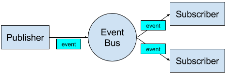

## esp_gpio 

Provides pin manipulation macros operating on registers which is 
faster then SDK provided functions.

#### TODO

- [ ] Support for GPIO16
- [ ] Interrupts

## esp_sdo

>Stupid bit of code that does the bare minimum to make os_printf work.
 
Jeroen Domburg `stdout.c` code allowing to use RX pin as the GPIO3.

## esp_json 

Make JSON manipulation easier.

This library is an adoption of https://github.com/DaveGamble/cJSON for ESP8266. 
Requires SDK 2.1.0.

## esp_cfg

Library for storing custom data structures on flash to keep it between 
resets / reboots. Depending on your configuration, linker script and 
data size you may have to customize `ESP_CFG_START_SECTOR` in `esp_config.h` 
file. By default it's set to sector `0xC` (one sector is 4096 bytes) which 
is located before user app (`0x10000`).  

By default user can use two configuration structures. You may change it by 
defining `ESP_CFG_NUMBER` or editing `esp_config.h` file (making this 
change requires changing `ESP_CFG_START_SECTOR`).

## esp_aes

Adoption of https://github.com/kokke/tiny-AES-c for ESP8266.

Comes with [gen_aes.sh](../bin/gen_aes.sh) to generate keys using `openssl rand`.

## esp_tim

Collection of helpers to deal with timers.

# esp_eb

This library will allow you to:
 - create custom events
 - trigger custom events
 - attach / detach event listeners (callbacks)
 - pass arguments during event trigger
 
All event callbacks are scheduled with timers not to block the CPU when there are many listeners.

